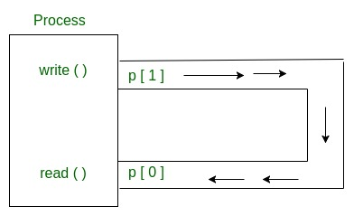
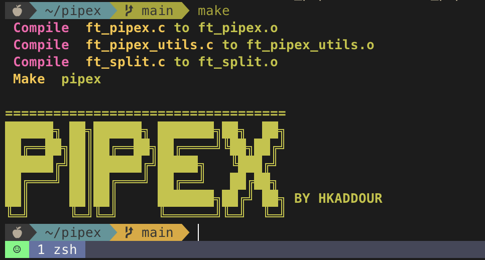

# Pipex

> The project PDF:
```
https://cdn.intra.42.fr/pdf/pdf/44339/en.subject.pdf
```
### The idea of the project:
:wave:first you need to study the behavior of the actual pipe `|` and see how it work under the hood, then you need to learn about this system calls `fork` `pipe` `dup & dup2` `close` `access` `execve` `exit` `perror`, now the idea of the project is to execute the first cmd1 and write it in the infile and the infile will send it to fd[1] of the pipe as an output and the fd[1] will send it to fd[0] of the pipe as input and the cmd2 will execute and output in the outfile.

**Source:**
1. Pipex: [Check it out.](https://csnotes.medium.com/pipex-tutorial-42-project-4469f5dd5901)
2. Process: [Check it out.](https://www.gnu.org/software/libc/manual/html_node/Processes.html#:~:text=A%20process%20executes%20a%20program,Processes%20are%20organized%20hierarchically.)
3. Pipe: [Check it out.](https://www.geeksforgeeks.org/piping-in-unix-or-linux/)
4. Pipe: [Check it out.](https://linuxhint.com/pipe_system_call_c/)
5. I/O: [Check it out.](https://www.geeksforgeeks.org/input-output-system-calls-c-create-open-close-read-write/)
6. dup & dup2: [Check it out.](https://www.geeksforgeeks.org/dup-dup2-linux-system-call/)
7. Fork: [Check it out.](https://www.geeksforgeeks.org/c-program-demonstrate-fork-and-pipe/)
8. Fork: [Check it out.](https://themittenmac.com/low-level-process-hunting-on-macos/)
9. Simulating pipe: [Check it out.](https://www.youtube.com/watch?v=6xbLgZpOBi8&t=216s&ab_channel=CodeVault)
10. execve: [Chek it out.](https://man7.org/linux/man-pages/man2/execve.2.html)
11. execve: [Chek it out.](https://jameshfisher.com/2017/02/05/how-do-i-use-execve-in-c/)
12. fd, dup/dup2: [Check it out.](https://www.youtube.com/watch?v=EqndHT606Tw&ab_channel=holidaylvr)
13. Pipe video: [Check it out.](https://www.youtube.com/watch?v=uHH7nHkgZ4w&ab_channel=holidaylvr)
14. Fork video: [Check it out.](https://www.youtube.com/watch?v=xVSPv-9x3gk)
15. dup2 code: [Check it out.](https://linuxhint.com/dup2_system_call_c/)
16. access: [Check it out.](https://www.geeksforgeeks.org/access-command-in-linux-with-examples/)
17. execve: [CHeck it out.](https://stackoverflow.com/questions/29615540/using-execve-in-c)
18. exit: [Check it out.](https://www.geeksforgeeks.org/understanding-exit-abort-and-assert/)
19. Makefile color font: [Check it out.](https://stackoverflow.com/questions/5947742/how-to-change-the-output-color-of-echo-in-linux)
20. Posix name: [Check it out.](https://www.google.com/search?q=posix+name&rlz=1C5CHFA_enMA972MA972&oq=posix+name&aqs=chrome..69i57.3680j0j7&sourceid=chrome&ie=UTF-8)
**You can also man those fuction.**


# My final point:

I didn't do the bonus part for now.

**Thank you for reading, have a good one :rocket:.**
